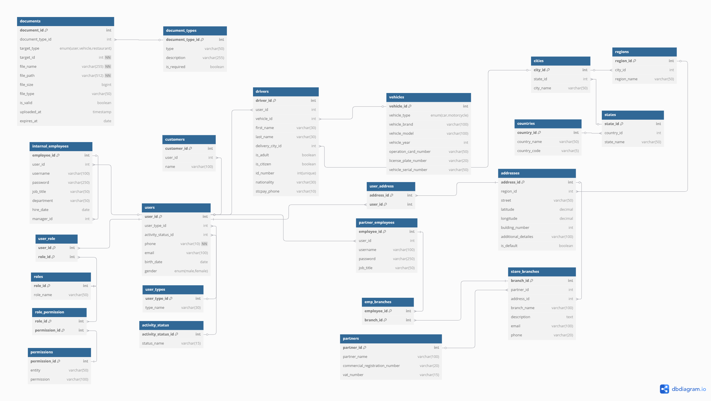

# 🍽️ User Registration ERD – Saudi Food Delivery App

This ERD outlines the **User Registration** system for a Saudi-based food delivery application. It supports different user types and roles across four platforms:

- 👤 Customer App  
- 🛵 Delivery Driver App  
- 🍔 Partner (Restaurant) App  
- 🧑‍💼 Internal Company Employee App

---

## 🧩 Data Model Overview

This data model supports a modular and scalable user management system for a multi-sided food delivery platform. It provides:

- A **central user system** to register and manage all users, regardless of type.
- Clear **user-type segregation** for customers, delivery drivers, partners staff, and internal staff.
- A **role and permission system** for access control, especially for internal users and partner staff.
- Comprehensive **address and location mapping**, including regions and default delivery locations.
- **Document handling** for IDs, licenses, and legal papers required by drivers and partners.
- **Partner structure** including restaurants, branches, and employee access.
- **Vehicle management** for delivery drivers.

---

## 📊 ERD Diagram

  

---

## 👤 users

This is the core table where all users (customers, drivers, partners staff, employees) are stored.

- **Key fields**: `user_id`, `user_type_id`, `phone`, `email`, `birth_date`, `gender`
- **Linked to**:  
  - `user_types` (to define what kind of user)  
  - `activity_status` (to know if user is active/inactive)  
  - `user_role` (to control access via roles)  
  - Additional profile data in: `customers`, `drivers`, `partner_employee`, `internal_employees`

---

## 🧑‍💼 user_types

Defines the type of user:
- `customer`
- `driver`
- `partner_employee`
- `internal_employee`

Each user must belong to one user type.

---

## 🟢 activity_status

Shows whether a user is active, inactive, banned or suspended.  
Useful for temporary suspensions or soft deletes.

---

## 🗺️ Geographic Hierarchy

Location is modeled with five tables to reflect detailed Saudi address structure:
- `countries` → `states` → `cities` → `regions` → `addresses`

Each `address` is tied to a specific `region`, and includes:
- `street`, `latitude`, `longitude`, `building_number`, and an optional `additional_details`

Users are linked to addresses via `user_address`, allowing each user to have one or more addresses and mark a default.

---

## 🛡️ Roles & Permissions

To manage access across internal tools or partner portals, the system uses Role-Based Access Control (RBAC).

- `roles`: Defines roles like `admin`, `support_agent`, or `restaurant_manager`
- `permissions`: Defines what a role can do on entities (e.g., `orders:view`, `staff:create`)
- `user_role`: Maps users to roles
- `role_permission`: Maps roles to permissions
- 
---

## 👥 Customers

`customers` stores personal data for customer-type users.

- Linked to `users` via `user_id`
- Includes the customer's name

---

## 🛵 Drivers

`drivers` stores information for delivery personnel.

- Linked to `users` via `user_id`
- Includes:
  - First and last name
  - National ID and nationality
  - STC Pay phone
  - Delivery city
  - Flags like `is_adult` and `is_citizen`
  - Linked `vehicle_id` for their registered transport

---

## 🚗 Vehicles

`vehicles` stores info about a driver’s transportation method.

- Fields include vehicle type (`car`, `motorcycle`), model, brand, year, operation_card_number, license plate, and serial numbers

Each driver has one associated vehicle.

---

## 📂 Documents & Document Types

Used to store uploaded files like ID, license, insurance, etc.

- `document_types` defines allowed types (e.g., `license_front`, `insurance`) and whether they’re required
- `documents` stores actual uploads and metadata:
  - `file_path`, `file_type`, `file_size`, `is_valid`, `uploaded_at`, `expires_at`
  - Can be attached to `user`, `vehicle`, or `restaurant` using `target_type` and `target_id`

**Example**:  
A driver might upload a national ID (`target_type = 'user'`, `target_id = user_id`).

---

## 🍴 Partners

`partners` represent restaurant brands or companies subsecribed to the platform.

- Stores business info like:
  - Commercial registration number
  - VAT number
  - Login credentials (username/password)

---

## 🏬 Store Branches

Each partner can have multiple `store_branches`.

- Linked to `partners` and `addresses`
- Contains contact info: name, phone, email, description

---

## 👨‍🍳 Partner Employees

`partner_employees` stores accounts for staff working at partner stores.

- Linked to `users` via `user_id`
- Has credentials and job title
- Connected to store branches through the `emp_branches` join table

**Example**:  
A cashier at a branch would have their own user account and be linked to that branch.

---

## 🧑‍💼 Internal Employees

`internal_employees` are staff members working within the company that owns the platform.

- Linked to `users` via `user_id`
- Has credentials, job title, department, hire date
- `manager_id` links to another internal employee (self-reference)

